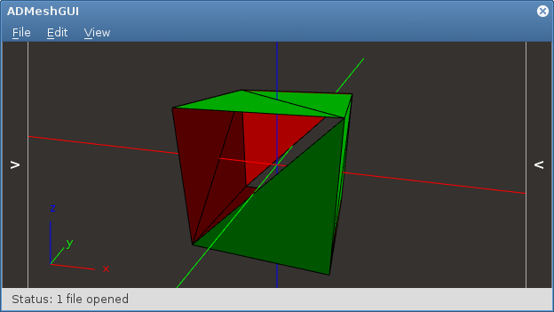
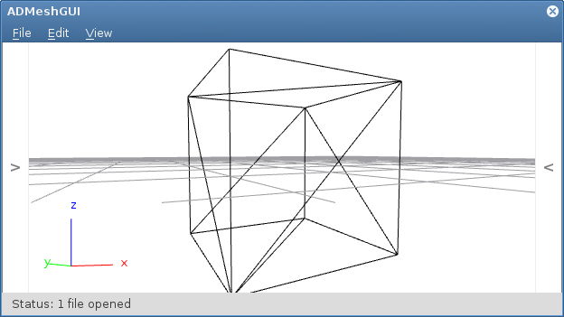

ADMeshGUI
=========

STL viewer and manipulation tool.

Manipulation and repair algorithms come from [ADMesh](https://github.com/admesh/admesh) library and [stlsplit](https://github.com/hroncok/stlsplit) library is used for splitting.
ADMeshGUI is licensed under the _GNU Affero General Public License, version 3_. Whole text of the license comes in LICENSE file which is included in this package.

Building
--------

In order to run ADMeshGUI, [ADMesh library](https://github.com/admesh/admesh), [stlsplit library](https://github.com/hroncok/stlsplit), [Qt 5.4](http://www.qt.io/download/) (or higher) with qmake, OpenGL and g++ are necessary.

On **Linux**, unzip downloaded package, navigate to target directory and type following into terminal:

    qmake # or qmake-qt5 on some distros
    make
    sudo make install
    
On **Mac OS X** use [homebrew](https://github.com/homebrew/homebrew). You can install ADMeshGUI directly from our homebrew tap by typing following into terminal:

    brew tap admesh/admesh
    brew install admeshgui --HEAD
    brew linkapps admeshgui

or if you prefer to build it manually, type following into terminal (installs all required dependencies):

    brew tap admesh/admesh
    brew install gettext qt5 admesh stlsplit
    /usr/local/opt/qt5/bin/qmake 
    make	

On **Windows** download [admeshgui-win.zip](https://github.com/vyvledav/ADMeshGUI/releases) containing precompiled application.

If you intend to build ADMeshGUI on Windows by yourself, the process is not that straightforward though. You must make sure Qt5 and all other dependendencies (admesh, stlsplit, gettext) are properly installed and paths set, so it is possible to link them. Then run *qmake* and *make* in terminal.

It is also possible to build ADMeshGUI in Qt Creator which comes with Qt package.

Running ADMeshGUI from command line tool
----------------------------------------

    admeshgui file_1.stl file_2.stl file_3.stl ... file_n.stl

Files given as parameters will be opened in ADMeshGUI. 

Features
--------

* **View** STL files 
    * Highlighted flaws
    * 3 modes: **solid**, **solid with highlighted edges** and **wireframe**
    * **Selection** of files. It is possible to have more files open and process only some.
    * User defined colors
* **Scale** by _x_, _y_ and _z_ axes
* **Mirror** along _xz_, _xy_ and _yz_ planes
* **Rotate** along _x_, _y_ and _z_ axes
* **Translate** in _x_, _y_ and _z_ directions
* **Merge** files
* **Split** files
* **Repair** files
    * **Fill** holes
    * Repair facets **orientation**
    * Repair **normals**
    * Remove **degenerate** facets
    * Repair facets by **connecting nearby** facets that are within a given tolerance
* **Save as** binary or ASCII STL
* **Export** to .OBJ, .OFF, .VRML, .DXF file formats

ADMeshGUI was succesfully run on following systems: Ubuntu 14.04 LTS, Fedora 21, Mac OS X 10.9 Mavericks, Mac OS X 10.10 Yosemite, Windows 7 64-bit
